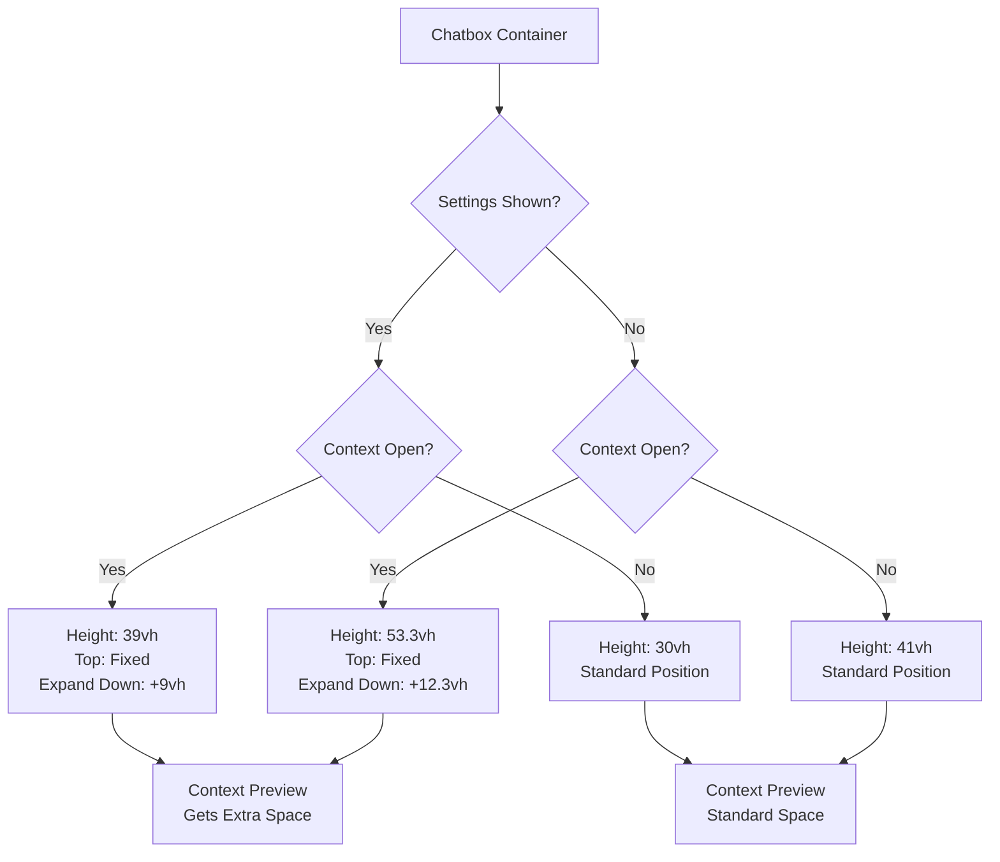

# Chatbox Context Expansion Implementation Plan

## Objective
Modify the chatbox so that when the context preview is opened, the chatbox expands downward by 30% while keeping the top edge in exactly the same position.

## Current Implementation Analysis

From examining the code, I can see:

1. **ChatInterface Container**: Currently has a fixed height that transitions between `h-[30vh]` (when settings shown) and `h-[41vh]` (normal state)
2. **Context Preview**: Currently positioned at the bottom of the input mode as a separate component that appears below the main input area
3. **Layout Structure**: The context preview is rendered inside the input mode container but doesn't affect the overall chatbox height

## Current Behavior vs. Desired Behavior

**Current:**
- Chatbox height: `41vh` (normal) or `30vh` (with settings)
- Context preview appears within the existing chatbox bounds
- No height change when context is opened

**Desired:**
- Chatbox height: Same as current when context is closed
- When context opens: Expand height by 30% downward only
- Top edge remains fixed in position
- Context preview gets more space to display properly

## Implementation Strategy

### 1. Dynamic Height Calculation
The chatbox height needs to be calculated dynamically based on three states:
- **Settings shown + Context closed**: `30vh`
- **Settings shown + Context open**: `30vh * 1.3 = 39vh`
- **Settings hidden + Context closed**: `41vh` 
- **Settings hidden + Context open**: `41vh * 1.3 = 53.3vh`

### 2. CSS Class Modifications

**Current ChatInterface container (line 74):**
```typescript
<div className={`transition-all duration-300 ${showSettings ? 'h-[30vh] mt-6' : 'h-[41vh]'}`}>
```

**New ChatInterface container:**
```typescript
<div className={`transition-all duration-300 ${
  showSettings 
    ? (showContextPreview ? 'h-[39vh] mt-6' : 'h-[30vh] mt-6')
    : (showContextPreview ? 'h-[53.3vh]' : 'h-[41vh]')
}`}>
```

### 3. Context Preview Positioning
The context preview should:
- Remain at the bottom of the input area
- Take advantage of the additional 30% height when expanded
- Maintain smooth transitions

### 4. Layout Adjustments
Since we're expanding downward only, we need to ensure:
- The main input area stays in the same position
- The context preview area gets the additional space
- Smooth transitions between states
- No layout shifts in other components

## Mermaid Diagram: Layout Behavior



## Implementation Steps

1. **Modify ChatInterface Height Logic**
   - Update the height calculation in `src/components/ChatInterface.tsx` line 74
   - Include `showContextPreview` state in the height calculation
   - Ensure smooth transitions with `transition-all duration-300`

2. **Adjust Context Preview Layout**
   - Ensure it utilizes the additional space effectively
   - Maintain proper spacing and proportions
   - May need to adjust the fixed height in `src/ContextPreview.tsx` line 75

3. **Test Responsive Behavior**
   - Verify the expansion works on different screen sizes
   - Ensure no overflow or layout issues

4. **Fine-tune Transition Timing**
   - Coordinate the height expansion with context preview appearance
   - Ensure smooth, professional animations

## Expected Outcome

After implementation:
- **Context Closed**: Chatbox behaves exactly as it currently does
- **Context Opened**: Chatbox expands downward by 30%, keeping top edge fixed
- **Smooth Transitions**: Professional animations between states
- **Responsive**: Works across all screen sizes
- **No Layout Shifts**: Other page elements remain unaffected

## Files to Modify
- `src/components/ChatInterface.tsx` (line 74) - Main height logic modification
- Potentially `src/ContextPreview.tsx` (line 75) - If layout adjustments needed for better space utilization

## Technical Details

### Key Props Available
- `showContextPreview: boolean` - Already passed to ChatInterface component
- `showSettings: boolean` - Already available in ChatInterface props

### Height Calculations
- Base heights: 30vh (with settings), 41vh (without settings)
- Expansion factor: 1.3 (30% increase)
- New heights: 39vh (30vh * 1.3), 53.3vh (41vh * 1.3)

### Transition Properties
- Use existing `transition-all duration-300` for smooth animations
- Coordinate with context preview's own transition timing

## Next Steps
1. Switch to Code mode to implement these changes
2. Apply the height calculation modifications
3. Test the expansion behavior in both settings states
4. Fine-tune context preview space utilization if needed